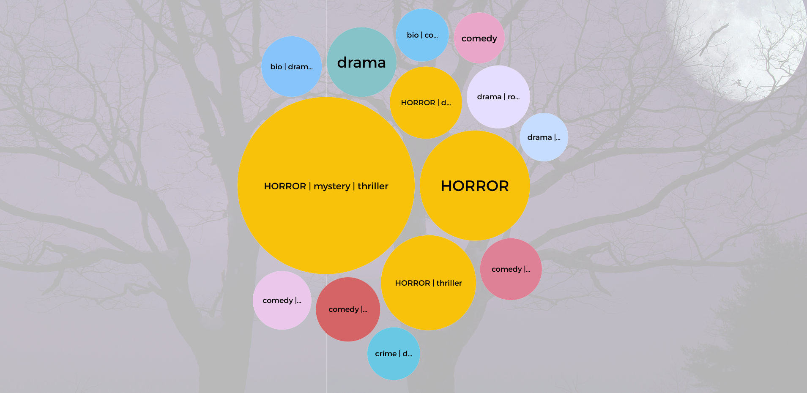
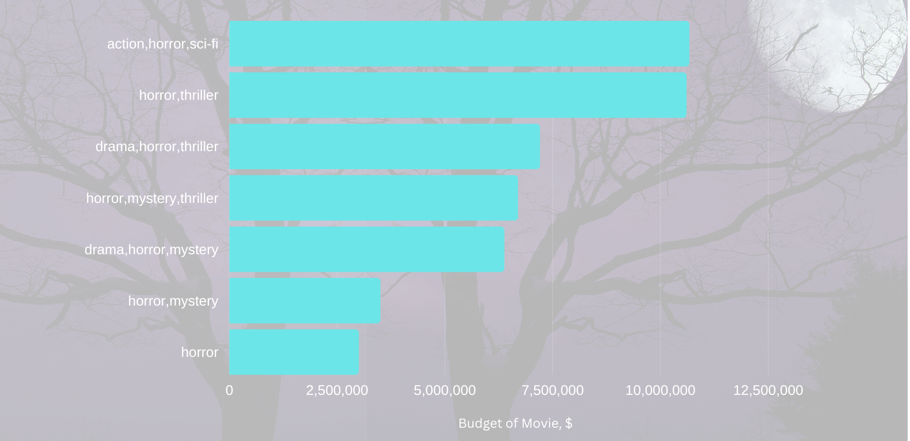
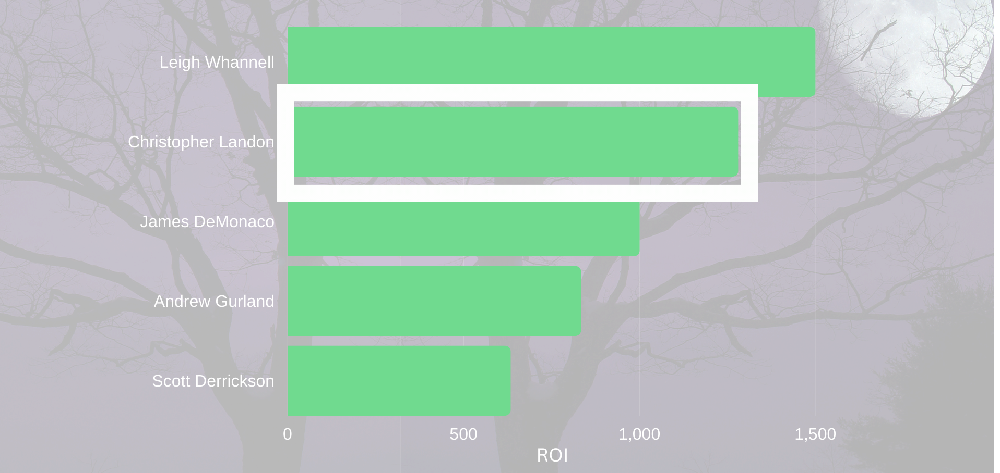

    

# ROI Analysis: Jelly Movie Studios

**Authors**: 
[Kari Primiano](mailto:kkprim@gmail.com), [Namsoo Lee](mailto:likej1218@gmail.com), [Andrei Hushcha](mailto:andrew.hushcha@gmail.com)

## Overview
This project examines the optimization of movie ROI for Jelly Movie Studios, which is launching a new film production division focused on original content. Descripitive analysis of domestic box office revenue data reveals a significantly higher ROI associated with genre selection, budget allocation, and the collaboration with distinguished writer/directors. By leveraging these strategic insights, Jelly Movie Studios may be able to create compelling original content within a realistic investment framework, while amplifying mass appeal through the association of a renowned writer/director.

## Business Understanding

    

Jelly Movie Studios may be able to increase the ROI of its new production studio while creating marketable original content and minimizing initial investment expenditures. This will allow Jelly Movie Studios to lay the foundation for audience-growth and a wider content range.

## Data Understanding
[IMDb](https://www.imdb.com/), a vast database for movie details, includes datasets of ratings, writers and directors, and other features (e.g. genre). [Box Office Mojo by IMDbPro](https://www.boxofficemojo.com/) links films with their respective box office earnings. And [The Numbers](https://www.the-numbers.com/), another premier provider of movie industry data, provides additional financial information (e.g. budget, top 10 genres by revenue). In these datasets, movie titles serve as unique identifiers, streamlining the correlation of information into our <a href="zippedData/master_dataset.csv">master dataset</a>. 

This project faces data limitations, including gaps spanning several years and incomplete sample sets. It lacks specific financials like streaming revenue and comprehensive budget figures, and the merging of fragmented datasets resulted in fewer relevant records.

## Methods
This project uses descriptive and statistical analyses, along with predictive modeling, to highlight key factors driving high ROI through correlation assessments and revenue forecasting.

## Results

Concentrating on genres where the quantity of movies is in the 75th percentile of profitability, horror ranks within the top four for highest ROI.

    

The budget explains only a small portion (17.9%) of the variance in revenue for horror movies. Therefore, although budget is statistically significant in this model, there are other variables that can influence horror movie revenue.

    

The optimal budget range for horror-themed genres within the highest quartile of ROI is between 3M - 11M.

    

In the realm of domestic horror films, Christopher Landon stands out as a writer/director associated with the highest ROI achievers.

    

## Conclusions
This analysis leads to three recommendations for Jelly Movie Studios to consider in maximizing ROI for its new production studio. 

**Horror genres have the highest ROI with an average of 942% where industry standard is between 110-125%.** In a dataset featuring 205 movie genres, our analysis focused on genres with at least six movies to assess Return on Investment (ROI). Notably, horror-related genres emerged as the top performers, boasting an impressive average ROI of 942%. This ROI percentage was calculated by dividing gross earnings by the budget and multiplying the result by 100.

**The ideal budget stands at $7 million.**To hit the top 25% in ROI for horror-centric genres, the prime budget allocation ranges from $3 million to $11 million.

**Collaborate with Christopher Landon.** Known for his versatile achievements as a writer, producer, and director in the horror genre, Christopher Landon promises a high return on investment and audience attraction in the domestic market.

## Next Steps
Further analysis is essential in determining critical drivers and gaining valuable insights:

- **Streaming Platforms:** Evaluate revenue streams and viewer demographics of streaming platforms prior to finalizing a distribution channel.
- **International:** Recognize the global footprint of influential horror films by including foreign movies in the analysis.
- **Sequels:** Explore the strategy of developing films with sequel potential to capitalize on established audiences.

## Appendix
The complete analysis can be found in the <a href="movie_studio_ROI_analysis.ipynb">Jupyter Notebook</a> and in our <a href="presentation.pdf">presentation</a>.

For general questions, please contact Kari Primiano at <a href="mailto:kkprim@gmail.com">kkprim@gmail.com</a>.
 
For presentation or visualizations questions, please contact Andrei Hushcha at <a href="mailto:andrew.hushcha@gmail.com">andrew.hushcha@gmail.com</a>.
 
For technical questions, please contact Namsoo Lee at <a href="mailto:likej1218@gmail.com">likej1218@gmail.com</a>.

**Sources**
 
<a href="https://www.imdb.com/">IMDb</a>
 
 
<a href="https://www.the-numbers.com/">The Numbers</a>
 
 
<a href="https://www.boxofficemojo.com/">Box Office Mojo by IMDbPro</a>
 
 
<a href="https://www.the-numbers.com/movie/budgets/all">Movie Budgets</a>
 
 
<a href="https://www.the-numbers.com/market/genres">Top 10 Genres by Revenue</a>
 
 
<a href="chrome-extension://efaidnbmnnnibpcajpcglclefindmkaj/https://www.stern.nyu.edu/sites/default/files/assets/documents/uat_024304.pdf">Industry ROI Standards</a>

## Repository Structure

├── images
 
├── zippedData
 
├── .gitignore
 
├── README.md
 
├── movie_studio_ROI_analysis.ipynb
 
└── presentation.pdf
